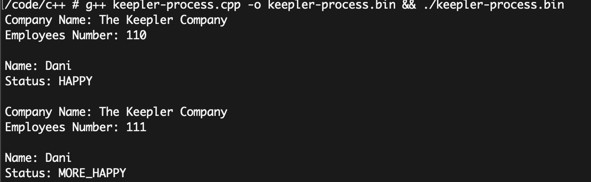

<div id="top"></div>

[](https://awesome.re) [](https://github.com/coderjojo/creative-profile-readme/graphs/contributors) [](https://github.com/coderjojo/creative-profile-readme/issues) [](https://github.com/coderjojo/creative-profile-readme/pulls) [](https://github.com/coderjojo/creative-profile-readme)


<!-- PROJECT SHIELDS -->
<!--
*** I'm using markdown "reference style" links for readability.
*** Reference links are enclosed in brackets [ ] instead of parentheses ( ).
*** See the bottom of this document for the declaration of the reference variables
*** for contributors-url, forks-url, etc. This is an optional, concise syntax you may use.
*** https://www.markdownguide.org/basic-syntax/#reference-style-links
-->

<!-- PROJECT LOGO -->
<br />
<div align="center">
  <a href="https://github.com/dsotovazquez/keepler-project-k/edit/master/README.md">
    
  </a>

  <h3 align="center">Keepler Challenge README</h3>

  <p align="center">
    README doc for the Keepler Challenge Code
    <br />
    <a href="https://github.com/dsotovazquez/keepler-project-k/"><strong>Explore the docs »</strong></a>
    <br />
    <br />
    <a href="https://github.com/dsotovazquez/keepler-project-k">View Demo</a>
    ·
    <a href="https://github.com/dsotovazquez/keepler-project-k/issues">Report Bug</a>
    ·
    <a href="https://github.com/dsotovazquez/keepler-project-k/">Request Feature</a>
  </p>
</div>


<!-- TABLE OF CONTENTS -->
<details>
  <summary>Table of Contents</summary>
  <ol>
    <li>
      <a href="#about-the-project">About The Project</a>
    <li>
      <ul>
        <li><a href="#built-with">Built With</a></li>
      </ul>
    </li>
    <li>
      <a href="#getting-started">Getting Started</a>
      <ul>
        <li><a href="#prerequisites">Prerequisites</a></li>
        <li><a href="#installation">Installation</a></li>
      </ul>
    </li>
    <li><a href="#usage">Usage</a></li>
    <li><a href="#contributing">Contributing</a></li>
    <li><a href="#license">License</a></li>
    <li><a href="#acknowledgments">Acknowledgments</a></li>
    <li><a href="#contact">Contact</a></li>
    
  </ol>
</details>


<!-- ABOUT THE PROJECT -->
## About The Project

[![Product Name Screen Shot][product-t]](https://example.com)

This project born in response to Keepler Code Challenge.

It is an attempt to show to the Keepler Architecture department some of my skills and experience as AWS Devops technician.

<p align="right">(<a href="#top">back to top</a>)</p>

## Execution Environment

The execution environment selected by Keepler for this challenge, was the developer assessment platform:

https://hackerearth.com

The assessment consist in several theoric questions and one programming use case.

The program will have one or more input files, according to the specifications mentioned. The program is run on each of those input files and the output generated by the program must match the correct output exactly in order to be judged correct.

In this assessment, the input files are logs that should be parsed by the program and should be sent to the output if the log lines meet some conditions as the severity of the event and the timestamp.

### Time Limit Work

The program must read, process, and output the result for all input files within the specified time limit. 

This means, if each of the input file contains multiple test cases, the code must complete all of these within that time limit. If the time limit is 1 second, and there may be 100 test cases and multiple input files, the program shouldn't be taking 1 second per test case - it needs to run all 100 in under 1 seconds.

### Total Execution Time

The code is tested multiple times with different input files. The execution time displayed is the total of the time spent for each input file. But the program is terminated if it exceeds the time limit mentioned in the problem while processing any input file. Hence:

* Total execution time <= (Time Limit * Number of input files)

### Total Memory Consumed

Total memory consumed by the program is sum of the memory consumed by program in stack, data, heap, and bss. 

### Local Testing

We should test the program in exactly the same way that online judge does. We need to create an input file and then run the program from the command line, using < and > to redirect the streams.

For example: 

```logProcess.py < sql.log```

### Requirements

The https://hackerearth.com specifies exactly runtimes versions that they use in his platform so the best strategy is to use exactly the same versions
locally.

To do so, we have implemented the local environment using docker images with these versions.

* [python 3.5.2]
* [docker 20.10.7]
* [curl 7.64.1]
* [mysql stable 8.0.27] (optional)

In the other hand, due to I have completed first the recomended test assessment by https://hackerearth.com and I have seen that the we have some SQL
questions in it, I have decided to implement a loca MySQL server locally too using the same docker images approach.

We have a `init.sh` bash script to deploy all of these infrastructure.

These docker images were deployed using Docker Desktop v3.5.1 in a MacOs Laptop Catalina v10.5.6.

    
<p align="right">(<a href="#top">back to top</a>)</p>


<!-- GETTING STARTED -->
## Getting Started


### Prerequisites

The only prerequisites to test locally is to have installed Docker Desktop v3.5.1 (you can use docker engine directly if you want too) and a bash shell.
I have installed too (but it is only optional) the mysql client to have access to the MySQL database from out of the docker images but it is not necesary.

### Preparing the Local Environment

To prepare the local environment, I have used the current dockerhub mysql docker image (based in Debian 10).
We have to install the same python runtime that we are executing in the hackerearth.com.

The Judge Environment documentation (https://www.hackerearth.com/docs/wiki/developers/judge/) specifies the 3.5.3 version for Python3.

To prepare these environment we have a bash script `log-processor/init.sh` that we can execute. These script, basically uses the swarm `log-processor/stack.yaml` to get the default mysql server root credential (we should remove this from the github repo in the future for security reasons), retrieves a zip file with a sample mysql database from the internet, pull, build and deploy the mysql docker image and loads the test database schema and data in the mysql server.

Then, it is going to deploy the right version of the python used in the hackerearth.com to have the same locally environment. As initially, I did not
know wich development language was going to be allowed to use, I have done the same thing with Java and node. Finally, we have used only python.

Finally too, we have not used the mysql server (I have used it in the test assessment previous to the keepler one.


### Installation

1. Clone the repo
   ```sh
   https://github.com/dsotovazquez/keepler-project-k
   ```
2. Copy the script to the right location
   ```sh
   cp -rp log-processor/src/processLog.py /usr/local/bin/
   chmod +x /usr/local/bin/processLog.py
   ```
3. Copy the sample sql.log (optional)

   ```sh
   cp -rp log-processor/input/sql.log /var/log
   ```
   
  
4. Maybe your would like to adjust the default severity (optional)
   Edit the processLog.py and change the default_severity variable.
   
5. Add the /usr/local/bin to you PATH vairable in your .bash_profile and

   ```sh
   source $HOME/.bash_profile
   ```
   
   
<p align="right">(<a href="#top">back to top</a>)</p>


<!-- USAGE EXAMPLES -->
## Usage

For use the script:

   ```
      cat /var/log/sql.log | processLog.py
   ```
   
 or:
 
   ```
      processLog.py < /var/log/sql.log
   ```
   
 and in general:
 
   ```
       processLog.py < INPUT_LOG
   ```
 

<p align="right">(<a href="#top">back to top</a>)</p>


<!-- ROADMAP -->
## Roadmap

- [x] Add README.md
- [x] Add program code
- [ ] Design the AWS architecture to execute this workload
- [ ] Add AWS IaC to execute these workload
- [ ] Implement the code in a compiled language like C++ and/or Java to accelerate the processing
- [ ] Send the logs to an ELK
- [ ] Implement a ML Sagemaker workload over the logs (maybe to classify the severity of the message and send an alerta based in the ML algorithm ?)

See the [open issues](https://github.com/dsotovazquez/keepler-project-k/edit/master/README.md/issues) for a full list of proposed features (and known issues).

<p align="right">(<a href="#top">back to top</a>)</p>


<!-- CONTRIBUTING -->
## Contributing

Contributions are what make the open source community such an amazing place to learn, inspire, and create. Any contributions you make are **greatly appreciated**.

If you have a suggestion that would make this better, please fork the repo and create a pull request. You can also simply open an issue with the tag "enhancement".
Don't forget to give the project a star! Thanks again!

1. Fork the Project
2. Create your Feature Branch (`git checkout -b feature/AmazingFeature`)
3. Commit your Changes (`git commit -m 'Add some AmazingFeature'`)
4. Push to the Branch (`git push origin feature/AmazingFeature`)
5. Open a Pull Request

<p align="right">(<a href="#top">back to top</a>)</p>


<!-- LICENSE -->
## License

Distributed under the MIT License. See `LICENSE.txt` for more information.

<p align="right">(<a href="#top">back to top</a>)</p>


<!-- CONTACT -->
## Contact

``` #include <iostream>
  
  using namespace std
  
  int main() {
    Keepler company = Keepler();
    Geek dani = Geek("Daniel Soto", "HAPPY", "dsotovazquez@gmail.com");
    
    company.show();
    dani.show();
    
    if (company.isCitizenK(dani)) {
      dani.setStatus("MORE_HAPPY");
      company.setEmployeesNumber(company.getEmployeesNumber() + 1);
      company.show();
      dani.show();
      
      company.contact_to(dani.getMail())
    }
}
   ```

You can find this oop code in the repo too and compiled and running ok:

<a href="https://github.com/dsotovazquez/keepler-project-k/keepler-project-oop/keepler-process.cpp" alt="Keepler Process">


Daniel Soto Vázquez 

<p align="center">
    <a href="https://www.linkedin.com/in/dsotovazquez/" alt="Linkedin"></a>
    <a href="mailto:dsotovazquez@gmail.com.com" alt="Contact me"></a>
    <a href="https://www.hackerearth.com/@dsotovazquez" alt="hackerearth.com"></a>
  </p>
  

Project Link: [https://https://github.com/dsotovazquez/keepler-project-k](https://github.com/dsotovazquez/keepler-project-k)

<p align="right">(<a href="#top">back to top</a>)</p>


<!-- ACKNOWLEDGMENTS -->
## Acknowledgments

* [Choose an Open Source License](https://choosealicense.com)
* [GitHub Pages](https://pages.github.com)
* [hackerearth.com](https://hackerearth.com)

<p align="right">(<a href="#top">back to top</a>)</p>


<!-- MARKDOWN LINKS & IMAGES -->
<!-- https://www.markdownguide.org/basic-syntax/#reference-style-links -->
[contributors-shield]: https://img.shields.io/github/contributors/othneildrew/Best-README-Template.svg?style=for-the-badge
[contributors-url]: https://github.com/othneildrew/Best-README-Template/graphs/contributors
[forks-shield]: https://img.shields.io/github/forks/othneildrew/Best-README-Template.svg?style=for-the-badge
[forks-url]: https://github.com/othneildrew/Best-README-Template/network/members
[stars-shield]: https://img.shields.io/github/stars/othneildrew/Best-README-Template.svg?style=for-the-badge
[stars-url]: https://github.com/othneildrew/Best-README-Template/stargazers
[issues-shield]: https://img.shields.io/github/issues/othneildrew/Best-README-Template.svg?style=for-the-badge
[issues-url]: https://github.com/othneildrew/Best-README-Template/issues
[license-shield]: https://img.shields.io/github/license/othneildrew/Best-README-Template.svg?style=for-the-badge
[license-url]: https://github.com/othneildrew/Best-README-Template/blob/master/LICENSE.txt
[linkedin-shield]: https://img.shields.io/badge/-LinkedIn-black.svg?style=for-the-badge&logo=linkedin&colorB=555
[linkedin-url]: https://linkedin.com/in/othneildrew
[product-screenshot]: images/screenshot.png
